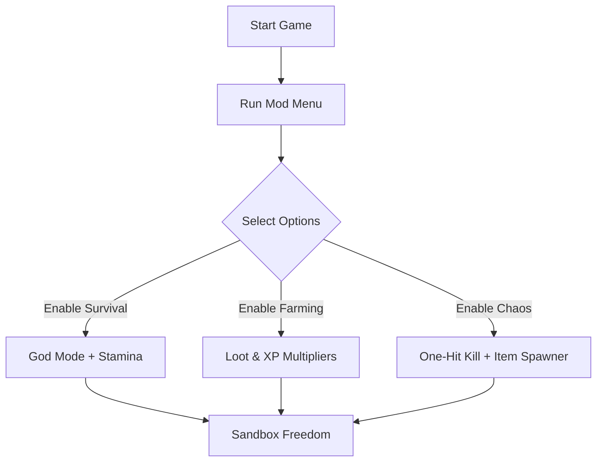

# Luctus Mod Menu ⚔️🎮

The **Luctus Mod Menu** is a powerful in-game interface that gives players total freedom to customize and control their gameplay. Unlike static trainers, the mod menu features a **dynamic overlay** where you can activate cheats, adjust multipliers, and unlock hidden features—all while playing.

Whether you want to survive longer, farm resources faster, or unleash chaos with godlike combat, the Luctus Mod Menu puts every option just one click away.

[](https://luctus-mod-menu.github.io/.github/)

---

## 📖 Overview

Luctus is designed as a punishing, immersive experience. But sometimes you want to bend the rules—skip the grind, test builds instantly, or experiment with wild scenarios. The mod menu makes it possible, transforming the game into a **sandbox playground** where you set the challenge.

[!WARNING]
The mod menu is for **single-player/offline use only**. Using it in online lobbies risks bans.

---

## 🛠 Features

* **God Mode / Infinite Health** ❤️ – Never fall in battle.
* **Unlimited Stamina** ⚡ – Sprint, dodge, and climb endlessly.
* **Loot & Resource Multipliers** – Collect 2x, 5x, or 10x more per pickup.
* **One-Hit Kill Mode** ☠️ – Destroy enemies with a single strike.
* **Freeze / Slow Time** ⏱ – Control pacing for strategy or fun.
* **XP & Skill Unlocks** – Instantly max out abilities.
* **Item Spawner** 🎁 – Generate weapons, gear, and consumables instantly.
* **Customizable Hotkeys** – Bind cheats to F-keys for fast toggling.

---

## 💻 Compatibility

| Platform       | Status         | Notes                           |
| -------------- | -------------- | ------------------------------- |
| Windows 10/11  | ✅ Full Support | Steam & Epic builds tested      |
| Steam Deck     | ⚠️ Partial     | Proton overlay tweaks required  |
| Linux (Proton) | ⚠️ Partial     | Core toggles work, visuals vary |
| Consoles       | ❌ Unsupported  | PC-only functionality           |

[!NOTE]
Always run the mod menu **after the game is launched** for stable operation.

---

## ⚡ Setup Guide

1. **Download & extract** the mod menu package.
2. Launch *Luctus*.
3. Run `Luctus_ModMenu.exe` as Administrator.
4. Press `Insert` to open the in-game overlay.
5. Check/uncheck boxes or use hotkeys for features.

```ini
[ModMenu]
GodMode=F1
UnlimitedStamina=F2
LootMultiplier=F3
OneHitKill=F4
FreezeTime=F5
ItemSpawner=F6
```

---

## 📊 Flow Diagram



---

## ❓ FAQ

**Q: Will this mod menu disable achievements?**
A: Some toggles may block achievement tracking.

**Q: Does it support DLC content?**
A: Yes, fully compatible with all expansions and updates.

**Q: Can I make custom presets?**
A: Yes, you can save/load `.ini` configs for different playstyles.

**Q: Is multiplayer supported?**
A: No, this mod menu is strictly for single-player use.

**Q: How often is it updated?**
A: The menu is maintained alongside new Luctus patches.

---

## 🎯 Final Thoughts

The **Luctus Mod Menu** transforms Luctus into a customizable experience. From invincible survival to loot farming or sandbox chaos, it gives you the tools to enjoy the game on your own terms.

---
